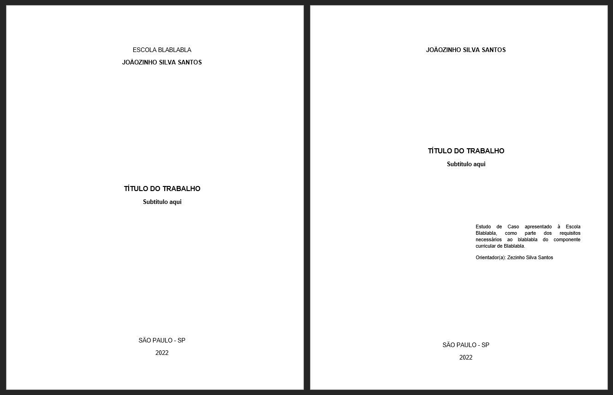

# ABNT Python Formatter

All of us know how boring is do the same format to School/University works all time.&nbsp;

This program is the **solution of your problems**. Does it automatically.&nbsp;

&nbsp;

## Requeriments

- **Python 3** to run the program

- **PyIP** to install the docx lib

        pip install python-docx

- **Word**

&nbsp;

## Usage

1 - Download the files

2 - Open the file `config.json`

3 - Edit with your informations (put 0/1 to desactivate/activate some pages)

        {
            "institution": "Escola Blablabla",
            "yourname": "Joãozinho Silva Santos",
            "title": "Título do trabalho",
            "titlelines": 1,
            "subtitle": "Subtítulo aqui",
            "city": "São Paulo - SP",
            "year": "2022",
            "notetext": "Estudo de Caso apresentado à Escola Blablabla, como parte dos requisitos necessários ao blablabla do componente curricular de Blablabla.",
            "notelines": 4,
            "advisor": "Zezinho Silva Santos",
            "dedicatory": 0,
            "thanks": 0,
            "epigraph": 0,
            "resume": 1,
            "abstract": 1,
            "summary": 1
        }

4 - Run the script `word.py`

---

That's it! Just open the `demo.docx` file to view your new formated document.

